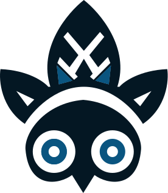

<h3 align="center">
  
   
  Totem Studios
</h3>

<h6 align="center">
  <a href="https://github.com/orgs/Totem-Studios/people" target="_blank"
    >People</a
  >
  ·
  <a href="https://github.com/orgs/Totem-Studios/teams" target="_blank"
    >Teams</a
  >
  ·
  <a href="https://github.com/orgs/Totem-Studios/repositories" target="_blank"
    >Repositories</a
  >
  ·
  <a href="https://github.com/Totem-Studios/docs-website" target="_blank"
    >Docs</a
  >
</h6>

 

  <a href="#">
    
    <!-- Stars badge for current repo -->
  </a>
  <a href="#">
    
    <!-- Latest release version for current repo -->
  </a>
  <a href="#">
    
    <!-- Issues for current repo -->
  </a>

 

  Welcome to the official GitHub page of Totem Studios! We are dedicated to
  building powerful software solutions with a focus on ease of use and
  efficiency. Our projects range from terminal-based applications to
  full-fledged IDEs and game engines. Dive into our repositories to discover
  tools that empower your development journey.
  <!-- Update text -->

  <a href="https://github.com/Totem-Studios" target="_blank">
    
    <!-- Github icon -->
  </a>
  <a href="https://discord.gg/9CM9vg8rhR" target="_blank">
    
    <!-- Discord icon -->
  </a>
  <a href="https://www.figma.com/@totemstudios" target="_blank">
    
    <!-- Figma icon -->
  </a>

 

Join our community and visit our pages!

&nbsp;

### Our philosophy

- **Abc**: xyz
- **Abc**: xyz
- **Abc**: xyz
<!-- Update text -->

&nbsp;

### Contributing

> [!IMPORTANT] 
> If you would like to submit a criticial bug or error, this could include security vulnerabilities, a current attack or even memory issues. Please report this to us immediately _privately_ through email to one of us:
>
> - **Pontus Henriksson**: <a href="mailto:pontus@henriksson.space">pontus@henriksson.space</a>
> - **Lucas Norman**: <a href="mailto:pontus@henriksson.space">pontus@henriksson.space</a> <!-- Update Lucas email -->
> - **Neo Mannskar**: <a href="mailto:neo.mannskar@gmail.com">neo.mannskar@gmail.com</a>

Your contributions and feedback are what help us grow and improve. If you're interested in contributing to any of our projects or have valuable feedback, please don't hesitate to reach out by email or read [our guide on how to contribute](../CONTRIBUTING.md).

### Licensing

Please note that most of our projects are open source and don't require express permission for use but that might differ on some projects. Always check the `LICENSE.md` file within each repository for specific licensing details about that specific project.

---

  Copyright © 2024 <a href="https://github.com/Totem-Studios">Totem Studios</a>

  <a href="#">
    
    <!-- License for current repo -->
  </a>

